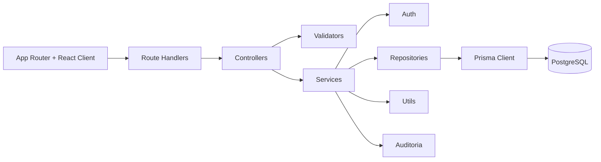

# Arquitectura por capas

## Decisiones técnicas

- App Router de Next 16 como borde full-stack.
- Lógica de negocio fuera de `app/api` para evitar acoplar reglas al framework.
- DTOs y validators separados para payloads predecibles.
- Refresh token persistido como hash para reducir exposición.
- Auditoría centralizada para trazabilidad.
- Cron jobs inicializados desde `instrumentation.ts`.
