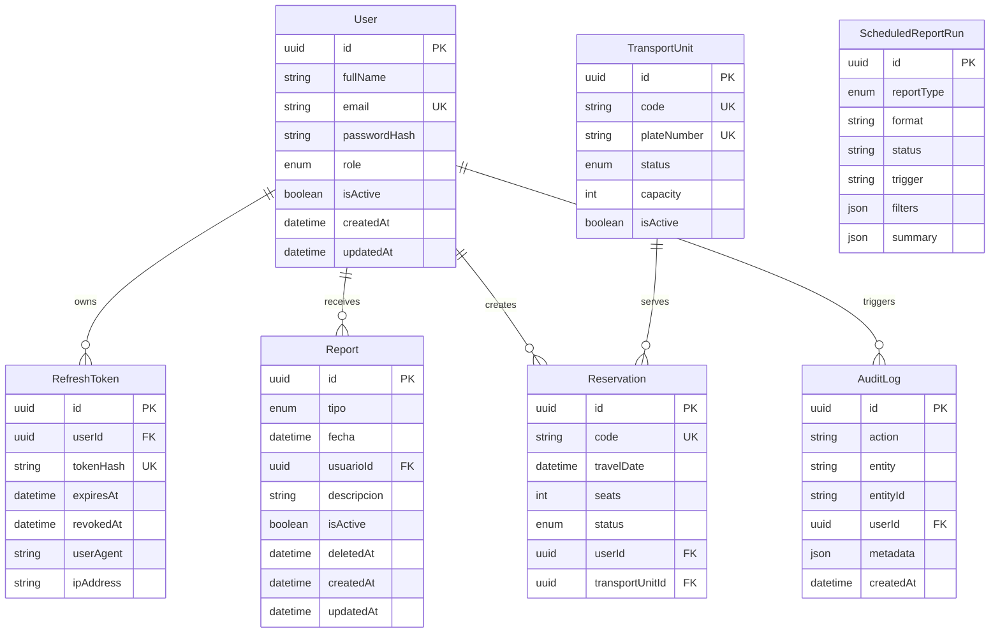

# ER Diagram

```mermaid
erDiagram
    User ||--o{ RefreshToken : owns
    User ||--o{ Report : receives
    User ||--o{ Reservation : creates
    User ||--o{ AuditLog : triggers
    TransportUnit ||--o{ Reservation : serves

    User {
        uuid id PK
        string fullName
        string email UK
        string passwordHash
        enum role
        boolean isActive
        datetime createdAt
        datetime updatedAt
    }

    RefreshToken {
        uuid id PK
        uuid userId FK
        string tokenHash UK
        datetime expiresAt
        datetime revokedAt
        string userAgent
        string ipAddress
    }

    Report {
        uuid id PK
        enum tipo
        datetime fecha
        uuid usuarioId FK
        string descripcion
        boolean isActive
        datetime deletedAt
        datetime createdAt
        datetime updatedAt
    }

    TransportUnit {
        uuid id PK
        string code UK
        string plateNumber UK
        enum status
        int capacity
        boolean isActive
    }

    Reservation {
        uuid id PK
        string code UK
        datetime travelDate
        int seats
        enum status
        uuid userId FK
        uuid transportUnitId FK
    }

    ScheduledReportRun {
        uuid id PK
        enum reportType
        string format
        string status
        string trigger
        json filters
        json summary
    }

    AuditLog {
        uuid id PK
        string action
        string entity
        string entityId
        uuid userId FK
        json metadata
        datetime createdAt
    }
```
