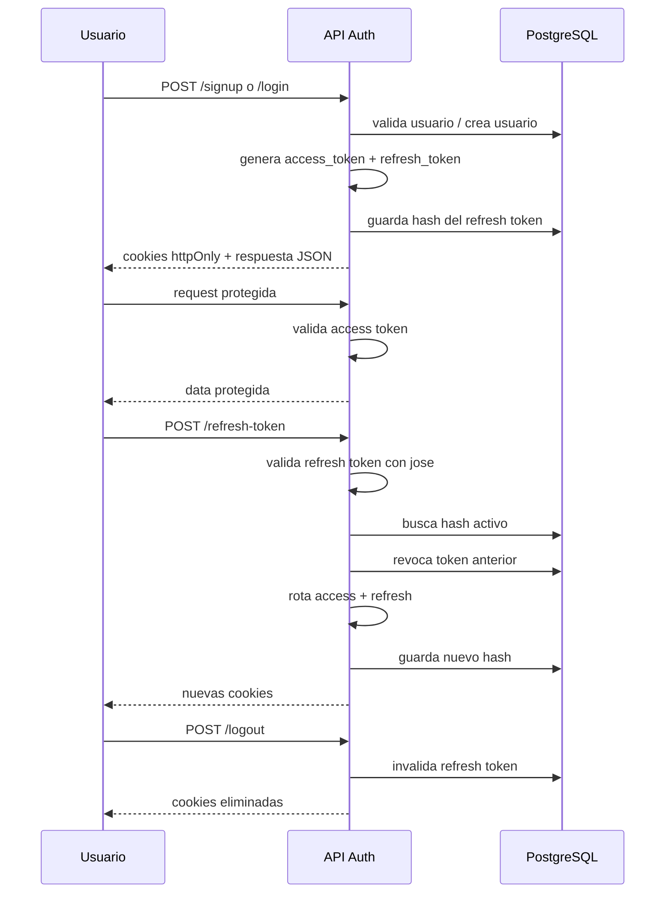

# JWT Flow

```mermaid
sequenceDiagram
    participant U as Usuario
    participant API as API Auth
    participant DB as PostgreSQL

    U->>API: POST /signup o /login
    API->>DB: valida usuario / crea usuario
    API->>API: genera access_token + refresh_token
    API->>DB: guarda hash del refresh token
    API-->>U: cookies httpOnly + respuesta JSON

    U->>API: request protegida
    API->>API: valida access token
    API-->>U: data protegida

    U->>API: POST /refresh-token
    API->>API: valida refresh token con jose
    API->>DB: busca hash activo
    API->>DB: revoca token anterior
    API->>API: rota access + refresh
    API->>DB: guarda nuevo hash
    API-->>U: nuevas cookies

    U->>API: POST /logout
    API->>DB: invalida refresh token
    API-->>U: cookies eliminadas
```
